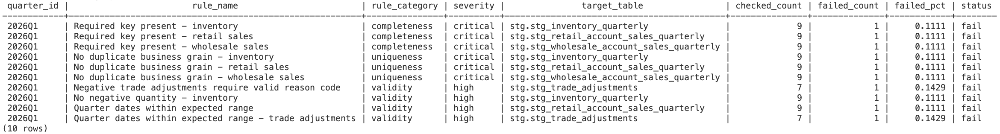
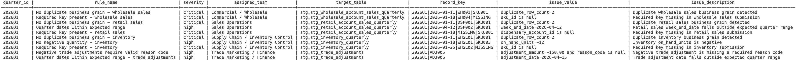
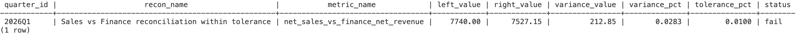
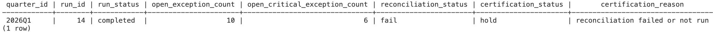

# Sample Outputs

## Purpose

This document shows sample outputs from the Quarterly Data Collection + QA/QC System after the reporting-layer views are built and the latest validation and reconciliation runs have been executed.

The goal is to make the final project outputs easy to review without requiring a dashboarding tool. These examples demonstrate:
- rule-level data quality results,
- open remediation-ready exceptions,
- quarter-level reconciliation status,
- and final certification outcome.

---

## 1. DQ Scorecard

### Source
`reporting.vw_dq_scorecard`

### Example query

```sql
select
    quarter_id,
    rule_name,
    rule_category,
    severity,
    target_table,
    checked_count,
    failed_count,
    failed_pct,
    status
from reporting.vw_dq_scorecard
order by rule_category, rule_name;
```

### Output



### What this shows

* The quarter has failures across completeness, uniqueness, and validity.
* Critical failures are present in retail, wholesale, and inventory sources.
* The scorecard makes it easy to see both the count failed and percent failed by rule.
* This is the main rule-level monitoring output for the project.

---

## 2. Open Exceptions

### Source

`reporting.vw_open_exceptions`

### Example query

```sql
select
    quarter_id,
    rule_name,
    severity,
    assigned_team,
    target_table,
    record_key,
    issue_value,
    issue_description
from reporting.vw_open_exceptions
order by assigned_team, rule_name, record_key;
```

### Output



### What this shows

* The system produces a remediation-ready exception queue, not just summary rule failures.
* Each issue is assigned to the business team best positioned to resolve it.
* Exceptions preserve business keys and concrete issue values, making them actionable.
* This is the main output for remediation workflow and issue ownership.

---

## 3. Reconciliation Summary

### Source

`reporting.vw_reconciliation_summary`

### Example query

```sql
select
    quarter_id,
    recon_name,
    metric_name,
    left_value,
    right_value,
    variance_value,
    variance_pct,
    tolerance_pct,
    status
from reporting.vw_reconciliation_summary
order by quarter_id, recon_name;
```

### Output



### What this shows

* Operational sales totals do not reconcile to finance net revenue within the approved 1.00% tolerance.
* Operational net sales exceed finance by 212.85.
* The variance percent is 2.83%, which is above tolerance.
* This output is the main quarter-level finance tie-out result.

---

## 4. Certification Output

### Source

`reporting.certified_quarterly_reporting`

### Example query

```sql
select
    quarter_id,
    run_id,
    run_status,
    open_exception_count,
    open_critical_exception_count,
    reconciliation_status,
    certification_status,
    certification_reason
from reporting.certified_quarterly_reporting
order by quarter_id;
```

### Sample output



### What this shows

* The latest validation run completed successfully.
* The quarter still has open exceptions, including critical ones.
* Reconciliation failed.
* The quarter is therefore placed on **hold** rather than certified for reporting.

---

## Summary Interpretation

Across the current sample quarter:

* multiple critical rule failures remain open,
* reconciliation failed against finance,
* and certification is correctly held.

This is the intended behavior for the portfolio scenario. The source submissions were intentionally designed with realistic defects so the QA/QC framework could demonstrate:

* governed rule execution,
* detailed exception tracking,
* quarter-level finance tie-out,
* and explicit certification decision support.
